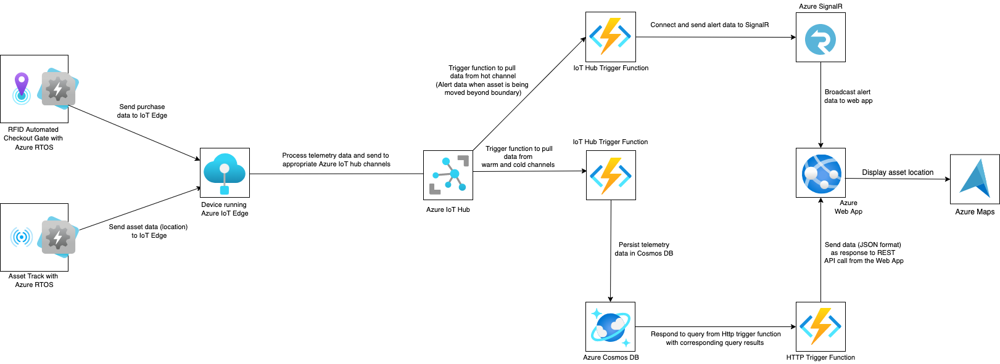

# RetailRobo

RetailRobo : A full-stack IoT cloud based solution for retail shop. I describe services and implementation strategies adopted to make RetailRobo scalable, reliable and secure. RetailRobo has 2 device/sensory components. The telemetry data used is simulated.

- RFID Automated Checkout Gate : This has RFID tags, RFID reader and RFID antenna as sensors. RFID tags are fixed on items on retail shop shelves. When customers pick up items and leave the store, the device reads the tags on each item. The IoT sensors pick up and send telemetry data such as Item identifier, item name, item price, item shelf number to the cloud. The data collected can be used to tally the items and automatically deduct the cost from the customer’s payment card. This will reduce customer’s waiting time and enhance the customer experience. The shelf data collected gives insights on shelves that need to be replenished.

- Asset Tracker : This is a  wireless IoT device that can be adopted to track shop assets like baskets and shopping carts. It comes with a Global Positioning System (GPS) sensor which can help pinpoint the location of an asset.The device transfers telemetry data such as asset identifier, asset GPS coordinates to the cloud. The shop manager can activate alarm and automatic locking systems on the wheels when a cart goes too far. This will prevent theft and ensure there are always enough carts for customers.

## CLOUD ARCHITECTURE

Cloud architecture is how technological units are organized to build a cloud, in which resources are pooled through virtualization technology and shared across a network. Microsoft Azure Cloud platform is used for this implementation. The adopted architecture is Lambda Architecture. Lambda Architectures is used because by design it handles vast amounts of data and has several features such as robustness, low latency of reading and updating, scalability, and extensibility. Below are the Azure Services adopted for this implementation. 

- Azure RTOS: RFID and GPS sensors contain microcontroller units and have limited computation and memory resources. Azure RTOS is a real time operating system designed to support highly constrained devices. Azure RTOS is deployed to the sensors to extend the sensors capability of securely ingesting data to the IoT edge using Azure RTOS Netx Duo module.

- Azure IoT Edge: Business logic can be containerised and implemented to scale locally with Azure IoT Edge. Edge devices running Azure IoT Edge receive telemetry data from sensors and perform calculations on the total cost of customer purchases as well as detect if a shopping cart has been moved too far.  

- Azure IoT Hub: is pivotal in achieving cloud-to-device end-to-end solutions. It acts as a central message repository for communication between an IoT application and devices. Edge devices securely connected to Azure Iot Hub and ingest sensor data through device-to-cloud telemetry messaging pattern.

- Azure Functions : provides an on-demand, event-driven service that allows you to write fewer blocks of code called functions which integrate services by using triggers and bindings. 

- Azure Cosmos DB : It is a NoSQL database technology with multi-master support at global scale with multiple well-defined consistency levels to meet various customer requirements. Azure Cosmos DB is used in storing telemetry data as JSON documents. 

- Azure SignalR Service : It is an Azure managed service that enables real time, scalable and secure communications between clients and service backend. In this implementation, Azure SignalR service is deployed to send real time alerts to Web App when retail assets that go beyond the location boundary.

- Azure Web App : It allows you to develop web apps in Azure without having to install, setup, or maintain your own  virtual servers. 
- Azure Map : Used in delivering seamless map experiences based on geo location of retail assets.

